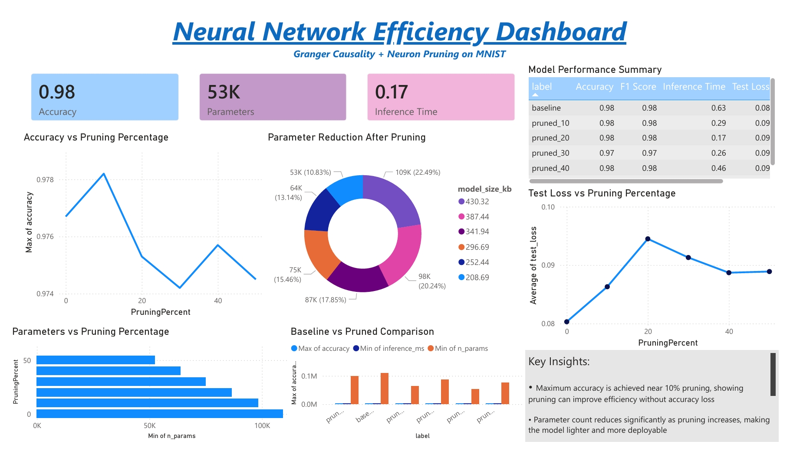
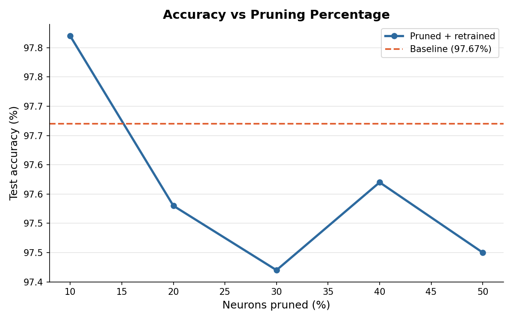

# Improving Neural Network Efficiency using Granger Causality and Neuron Pruning

This project shows how a trained neural network can be made smaller and faster without losing much accuracy.

The model learns to recognize handwritten digits from the MNIST dataset. After training, the project studies how the hidden neurons behave, finds neurons that are less useful, removes them, fine-tunes the smaller model, and compares the results.

In simple words: this project teaches a computer to read digits, then carefully removes unnecessary parts of the model so it can still perform well while becoming lighter.



## Overview

Neural networks often contain more neurons than they actually need. These extra neurons can make the model larger, slower, and harder to deploy on devices with limited memory or processing power.

This project builds an end-to-end pipeline that:

- trains a baseline neural network on MNIST,
- records how hidden neurons respond during prediction,
- applies Granger causality to study relationships between neurons,
- calculates an importance score for each neuron,
- removes the least important neurons at different pruning levels,
- fine-tunes the smaller models,
- evaluates accuracy, F1 score, loss, model size, parameter count, and inference time,
- saves charts, CSV files, trained models, and an interactive dashboard.

## Problem Statement

Modern machine learning models can be powerful, but they are often heavier than necessary.

The main problem this project addresses is:

> Can we reduce the size of a neural network while keeping its prediction quality almost the same?

For real-world use, this matters because a smaller model can:

- use less memory,
- run faster,
- cost less to deploy,
- work better on low-power devices,
- keep strong accuracy even after compression.

## Dataset

The main dataset used is MNIST.

MNIST is a popular dataset of handwritten digits from 0 to 9. Each image is a small 28 x 28 grayscale picture. The model receives the image and predicts which digit it represents.


## Features

- Complete training pipeline using PyTorch.
- Multi-layer perceptron model with two hidden layers.
- Activation logging for hidden neurons.
- Granger causality analysis between neuron activation patterns.
- Importance scoring using weight strength, activation behavior, and causality score.
- Structural pruning that actually rebuilds a smaller neural network.
- Fine-tuning after pruning to recover performance.
- Evaluation with accuracy, F1 score, loss, parameter count, model size, and inference time.
- Saved result files in CSV format.
- Saved trained models for baseline and pruned versions.
- Visual result charts.
- Interactive HTML dashboard for exploring model performance.

## How It Works

The project follows a clear pipeline.

### 1. Load the Data

The MNIST dataset is loaded using `torchvision`. Images are converted into tensors and normalized so the neural network can train more smoothly.

### 2. Train the Baseline Model

The baseline model is a simple fully connected neural network:

```text
Input image: 28 x 28 pixels = 784 values
Hidden layer 1: 128 neurons
Hidden layer 2: 64 neurons
Output layer: 10 classes, one for each digit
```

This first model is trained normally and becomes the reference model. All pruned models are compared against it.

### 3. Record Neuron Activations

After training, the pipeline observes the hidden neurons while the model processes data.

A neuron activation means how strongly that neuron responds to the input. If a neuron rarely responds or does not contribute useful behavior, it may be a good candidate for pruning.

The project saves these activation values in:

```text
results/activations.csv
```

### 4. Apply Granger Causality

Granger causality is a statistical method used to check whether one time series helps predict another time series.

In this project, each neuron's activation pattern is treated like a small time series. The method asks:

> Does the past behavior of one neuron help explain the future behavior of another neuron?

If the answer is yes, that neuron may be part of an important information flow inside the model. If the answer is no, it may be less important.

Only statistically meaningful links are kept using:

```text
p-value < 0.05
```

This filtered causality matrix is saved in:

```text
results/granger_matrix_filtered.csv
```

### 5. Score Neuron Importance

Each neuron receives an importance score based on three signals:

| Signal | Meaning |
|---|---|
| Weight magnitude | How strong the neuron's learned connections are |
| Activation behavior | How much the neuron responds during prediction |
| Granger causality score | How strongly the neuron is connected to other neuron behavior |

The project combines these signals using this weighting:

```text
importance = 0.4 * weight_score + 0.3 * activation_score + 0.3 * granger_score
```

Neurons with lower scores are considered less important.

### 6. Prune the Model

The pipeline removes the lowest-scoring neurons at different pruning levels:

```text
10%, 20%, 30%, 40%, 50%
```

Structural pruning is used by default. This means the model is not just masking neurons. It is rebuilt as a smaller model with fewer hidden neurons, so the parameter count and model size actually decrease.

### 7. Fine-Tune the Pruned Model

After pruning, the smaller model is trained again for a few epochs. This helps the remaining neurons adjust and recover performance.

### 8. Evaluate and Visualize

Every model is evaluated and compared. The project saves:

- metrics table,
- trained model files,
- training history,
- pruning charts,
- Granger heatmap,
- loss recovery charts,
- dashboard screenshots,
- interactive dashboard.

## Results

The results show that the model can be made much smaller while keeping very strong accuracy.



### Main Metrics

| Model | Accuracy | F1 Score | Test Loss | Parameters | Model Size | Inference Time |
|---|---:|---:|---:|---:|---:|---:|
| Baseline | 97.67% | 0.9765 | 0.0803 | 109,386 | 430.32 KB | 0.625 ms |
| Pruned 10% | 97.82% | 0.9781 | 0.0863 | 98,436 | 387.44 KB | 0.286 ms |
| Pruned 20% | 97.53% | 0.9751 | 0.0945 | 86,793 | 341.94 KB | 0.168 ms |
| Pruned 30% | 97.42% | 0.9740 | 0.0913 | 75,205 | 296.69 KB | 0.261 ms |
| Pruned 40% | 97.57% | 0.9755 | 0.0887 | 63,887 | 252.44 KB | 0.458 ms |
| Pruned 50% | 97.45% | 0.9742 | 0.0889 | 52,650 | 208.69 KB | 0.458 ms |

### Key Findings

- The baseline model reaches 97.67% accuracy.
- The 10% pruned model reaches 97.82% accuracy, which is slightly better than the baseline.
- The 50% pruned model keeps 97.45% accuracy while reducing parameters from 109,386 to 52,650.
- At 50% pruning, the model size drops from 430.32 KB to 208.69 KB.
- This means the model becomes much smaller while losing only 0.22 percentage points of accuracy compared with the baseline.
- The best balance is around 10% to 20% pruning, where the model becomes lighter while keeping almost identical performance.

## Project Structure

```text
mnist/
|-- README.md
|-- LICENSE
|-- .gitignore
|-- requirements.txt
|-- run_pipeline.py
|-- dashboards/
|   |-- index.html
|   |-- OverView.jpeg
|   |-- Granger Causality Analysis Dashboard.jpeg
|   |-- FINAL_YEAR_PROJECT.pbix
|-- data/
|   |-- .gitkeep
|-- notebooks/
|   |-- pipeline_walkthrough.ipynb
|-- results/
|   |-- accuracy_vs_pruning.png
|   |-- granger_heatmap.png
|   |-- metrics.csv
|   |-- training_curves.png
|   |-- loss_recovery_10.png
|   |-- loss_recovery_20.png
|   |-- loss_recovery_30.png
|   |-- loss_recovery_40.png
|   |-- loss_recovery_50.png
|-- src/
    |-- config.py
    |-- data.py
    |-- evaluation.py
    |-- granger.py
    |-- model.py
    |-- pruning.py
    |-- trainer.py
    |-- visualization.py
```

## Setup

### 1. Create a Virtual Environment

```bash
python -m venv .venv
```

Activate it on Windows:

```bash
.venv\Scripts\activate
```

Activate it on macOS or Linux:

```bash
source .venv/bin/activate
```

### 2. Install Requirements

```bash
pip install -r requirements.txt
```

## Usage

Run the full pipeline:

```bash
python run_pipeline.py
```

Run with custom pruning percentages:

```bash
python run_pipeline.py --prune-pcts 10 20 50
```

Run with custom training epochs:

```bash
python run_pipeline.py --epochs-baseline 10 --epochs-finetune 5
```

Run on another supported dataset:

```bash
python run_pipeline.py --dataset car
python run_pipeline.py --dataset sonar
```

Use masking instead of structural model rebuilding:

```bash
python run_pipeline.py --no-structural
```

## Outputs

After running the pipeline, the most important outputs are:

| File | Purpose |
|---|---|
| `results/metrics.csv` | Final comparison of baseline and pruned models |
| `results/activations.csv` | Logged hidden-neuron activations |
| `results/granger_matrix_filtered.csv` | Statistically filtered causality matrix |
| `results/models/baseline.pt` | Saved baseline model |
| `results/models/pruned_*.pt` | Saved pruned models |
| `results/accuracy_vs_pruning.png` | Accuracy comparison chart |
| `results/granger_heatmap.png` | Visual map of neuron causality links |
| `dashboards/index.html` | Interactive browser dashboard |

Large generated files such as downloaded MNIST data, activation logs, Granger matrices, training-history CSV files, and model checkpoints are intentionally ignored by Git. They are recreated automatically when the pipeline is run.

## Dashboard

Open this file in a browser to explore the interactive dashboard:

```text
dashboards/index.html
```

The dashboard lets you compare baseline and pruned models using accuracy, F1 score, loss, parameter count, and inference time.

## Technical Summary

This project combines deep learning compression with statistical causality analysis. Instead of pruning neurons only by weight size, it also studies activation behavior and neuron-to-neuron influence. This makes pruning more informed because the model removes neurons based on multiple signs of importance.

The result is a practical and explainable compression pipeline:

```text
Train -> Observe neurons -> Measure causality -> Score importance -> Prune -> Fine-tune -> Evaluate
```

## Conclusion

The project proves that a neural network can be compressed without heavily damaging its performance. On MNIST, the model keeps high accuracy even after removing up to 50% of hidden neurons.

This makes the project useful for model optimization, edge deployment, explainable pruning, and research on efficient neural networks.
